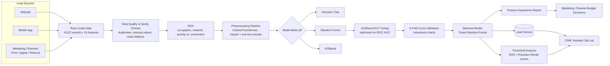

# ExtraaLearn: Predictive Lead Scoring for EdTech Sales Prioritization


## Executive Summary

**Objective:** ExtraaLearn, an early-stage EdTech startup, generates a high volume of leads across web, mobile, and marketing channels but has no systematic way to tell which leads are worth a sales rep's time. This project develops a lead-scoring classification model that ranks each lead by conversion probability, surfaces the behavioral and channel-level drivers behind conversion, and turns those drivers into a concrete resource-allocation strategy for sales and marketing.

**Business Impact:**
* Delivered a production-candidate **Random Forest lead-scoring model** at **92.8% ROC-AUC** and **77.7% F1-score** (5-fold CV: AUC 0.928 ± 0.006), replacing "call leads in the order they arrive" with a ranked, probability-based worklist.
* Identified **engagement intensity** (time on site, visit count, page views) and **profile completion level** as the top conversion drivers — both are front-of-funnel signals the business can act on before a sales rep is ever involved.
* Quantified that **direct two-way contact** (phone, detailed email) out-converts passive browsing, and that **digital/referral channels** consistently beat print — feeding directly into a marketing budget reallocation recommendation.
* Benchmarked the tuned Random Forest against XGBoost and validated the classification threshold against ROC/Precision-Recall curves using ExtraaLearn's actual cost asymmetry (missed revenue vs. wasted sales effort), rather than defaulting to 0.5 without justification.

## Stakeholders & Cross-Functional Teams

Framed as a cross-functional initiative, this project required input from and delivery to three groups:

* **Sales Operations:** Owns the daily call list and needed a ranked, explainable scoring output rather than a black-box probability.
* **Marketing:** Owns channel budget allocation and needed channel-level conversion-rate evidence (print vs. digital vs. referral) to justify reallocation.
* **Product / Growth:** Owns the website/app profile-completion flow and needed evidence that profile completion is a genuine intent signal worth investing UX effort in.

## System Architecture

The solution is a batch-scored classification pipeline: raw lead records flow through a shared preprocessing pipeline, into a benchmarked model, and out as a ranked lead list plus a feature-importance report for stakeholders.



## Program Metrics & KPIs

| Metric | Target | Achieved | Status |
| :--- | :--- | :--- | :--- |
| ROC-AUC (cross-validated) | > 0.90 | 0.928 (± 0.006) | 🟢 On Track |
| F1-score | > 0.75 | 0.777 | 🟢 On Track |
| Recall (catch real converters) | > 0.80 | 0.846 | 🟢 On Track |
| Precision (sales efficiency) | > 0.65 | 0.719 | 🟢 On Track |
| Model comparison coverage | ≥ 3 algorithms | 3 (Decision Tree, Random Forest, XGBoost) | 🟢 Complete |

## Roadmap & Milestones

Tracked via GitHub Projects (Kanban board) with issues tagged `data-pipeline`, `eda`, `modeling`, `enhancement`, and `documentation`.

* [x] **Milestone 1: Data Quality & EDA (Completed)** — sanity checks, missing-value audit, class-imbalance analysis, 4 targeted business-question analyses (occupation, first-interaction channel, last activity, marketing channel).
* [x] **Milestone 2: Baseline Modeling (Completed)** — preprocessing pipeline, Decision Tree baseline (F1 0.749, ROC-AUC 0.921).
* [x] **Milestone 3: Ensemble & Tuning (Completed)** — Random Forest baseline and `GridSearchCV`-tuned version (ROC-AUC 0.928), feature importance extraction.
* [x] **Milestone 4: Benchmark & Threshold Validation (Completed)** — XGBoost comparison, ROC/Precision-Recall curve analysis, business-justified threshold selection.
* [ ] **Milestone 5: CRM Integration (Planned)** — expose the scoring pipeline as a batch/API service consumed by the CRM lead-scoring widget.
* [ ] **Milestone 6: Monitoring & Retraining Cadence (Planned)** — scheduled retraining job and drift monitoring as marketing mix and user behavior evolve.

**Issue & PR conventions:** issues use `enhancement` / `bug` / `data-pipeline` / `modeling` labels; PRs follow a template covering *what changed*, *metric impact (before/after ROC-AUC/F1)*, and *stakeholder(s) affected* (Sales / Marketing / Product), so reviewers can trace every change back to a business owner.

## Model Comparison

| Model | Accuracy | Precision | Recall | F1 | ROC-AUC | Notes |
|---|---|---|---|---|---|---|
| Decision Tree | 0.829 | 0.667 | 0.855 | 0.749 | 0.921 | Solid baseline; splits on engagement features, but a single tree is unstable |
| Random Forest (base) | 0.854 | 0.721 | 0.834 | 0.774 | 0.927 | Ensembling reduced overfitting vs. the single tree |
| **Random Forest (tuned)** | **0.855** | **0.719** | **0.846** | **0.777** | **0.928** | **Selected model** — best recall/precision balance for this cost structure |
| XGBoost | 0.833 | 0.735 | 0.692 | 0.713 | 0.910 | Higher precision but meaningfully lower recall — would miss more real converters |

**Why Random Forest over XGBoost:** for ExtraaLearn, a missed converter (false negative) is lost revenue, while contacting a non-converter (false positive) only costs sales time. XGBoost's recall (69.2%) was too low for that cost asymmetry, so the tuned Random Forest — 84.6% recall at comparable F1 — was selected as the candidate for production.

## Technical Implementation

### Prerequisites
* Python 3.10+
* scikit-learn, XGBoost
* Jupyter / Google Colab (development environment)

### Local Setup
```bash
git clone https://github.com/yourusername/extraalearn-lead-conversion.git
cd extraalearn-lead-conversion
pip install -r requirements.txt
jupyter notebook notebooks/potential_customers_prediction.ipynb
```

### Notable Code

**Preprocessing pipeline** — shared across every model in the bake-off so comparisons are apples-to-apples:

```python
numeric_transformer = Pipeline(steps=[
    ("imputer", SimpleImputer(strategy="median")),
])
categorical_transformer = Pipeline(steps=[
    ("imputer", SimpleImputer(strategy="most_frequent")),
    ("onehot", OneHotEncoder(handle_unknown="ignore")),
])
preprocessor = ColumnTransformer(transformers=[
    ("num", numeric_transformer, numeric_features),
    ("cat", categorical_transformer, categorical_features),
])
```

**Tuned Random Forest**, with class-imbalance handling and hyperparameter search optimized directly on ROC-AUC:

```python
rf_clf = RandomForestClassifier(
    random_state=42, n_estimators=200, max_depth=None,
    min_samples_split=20, min_samples_leaf=10,
    class_weight="balanced_subsample", n_jobs=-1,
)
rf_pipeline = Pipeline([("preprocess", preprocessor), ("model", rf_clf)])

param_grid = {
    "model__n_estimators": [150, 200],
    "model__max_depth": [None, 8, 12],
    "model__min_samples_split": [10, 20],
    "model__min_samples_leaf": [5, 10],
}
grid_search = GridSearchCV(rf_pipeline, param_grid, scoring="roc_auc", cv=3, n_jobs=-1)
grid_search.fit(X_train, y_train)
best_rf = grid_search.best_estimator_
# Best params: max_depth=8, min_samples_leaf=5, min_samples_split=20, n_estimators=200
# Best CV ROC-AUC: 0.9268
```

**5-fold cross-validation** across all metrics simultaneously, rather than trusting a single train/test split:

```python
cv_results = cross_validate(
    best_rf, X, y, cv=5,
    scoring=["roc_auc", "accuracy", "precision", "recall", "f1"]
)
# Mean ROC-AUC: 0.928 (Std: 0.006)   Mean Recall: 0.847 (Std: 0.018)
# Mean F1: 0.775 (Std: 0.013)        Mean Precision: 0.714 (Std: 0.021)
```

## Threshold Analysis: Balancing Recall vs. Precision for the Business

Rather than defaulting to 0.5 without justification, ROC and Precision-Recall curves were reviewed against ExtraaLearn's actual cost structure: a **false negative** (missed converter) is lost revenue, while a **false positive** (wasted outreach) only costs sales time. At the default 0.5 threshold, the tuned model delivers **71.9% precision and 84.6% recall** — catching the large majority of real converters while keeping wasted-effort calls manageable. Given the startup's priority on not missing revenue, this threshold was confirmed rather than shifted further toward precision.

## Key EDA Findings

* **Occupation:** Professionals and unemployed leads convert at higher rates than students — stronger perceived ROI on upskilling.
* **First-touch channel:** Website-origin leads convert better than app-origin leads, pointing to a weaker mobile onboarding funnel.
* **Interaction mode:** Direct two-way contact (phone, detailed email) out-converts passive browsing — engagement *type*, not just volume, matters.
* **Channel quality:** Digital media and referrals outperform print, which drives awareness but weaker purchase intent.
* **Profile completion:** A strong, actionable intent signal — high completion correlates with significantly higher conversion.

## Actionable Recommendations

1. **Deploy the lead-scoring model in the CRM** to prioritize daily call lists by conversion probability rather than arrival order.
2. **Automate outreach triggers** when a lead crosses engagement thresholds (visits, time spent), instead of waiting for inbound requests.
3. **Launch profile-completion nudges** (progress bars, incentives) to move low-completion leads into the high-intent bucket.
4. **Reallocate marketing budget quarterly** away from underperforming print placements toward digital and structured referral programs.
5. **Retrain the model on a recurring cadence** as user behavior and marketing mix shift, to keep the scoring system accurate.

## Risk Management & Mitigation

* **Class imbalance bias:** mitigated via `class_weight="balanced_subsample"` in the Random Forest and by tracking F1/recall alongside accuracy throughout, rather than accuracy alone.
* **Overfitting on a 200-tree ensemble:** mitigated via `GridSearchCV` with cross-validation on `min_samples_split`/`min_samples_leaf`/`max_depth`, and confirmed with a separate 5-fold CV pass on the final model.
* **Stale scoring over time:** flagged as an open risk — behavior and channel mix will drift, so a retraining cadence is called out explicitly in Milestone 6 rather than treated as a one-time model.

## Repository Structure

```
extraalearn-lead-conversion/
├── notebooks/
│   └── potential_customers_prediction.ipynb
├── data/                     # not committed — see Setup
├── models/
│   └── best_rf_pipeline.pkl
├── reports/
│   └── eda_and_findings.pdf
├── README.md
└── requirements.txt
```

## Contributing & Governance

Please refer to `CONTRIBUTING.md` for branch naming conventions, PR template requirements (change summary, metric impact, stakeholder(s) affected), and review expectations. All model changes are expected to report before/after ROC-AUC and F1 in the PR description before merging to `main`.

## Tech Stack

`scikit-learn` (Pipeline, ColumnTransformer, GridSearchCV, RandomForestClassifier, DecisionTreeClassifier) · `XGBoost` · `pandas` / `numpy` · `matplotlib` / `seaborn`
